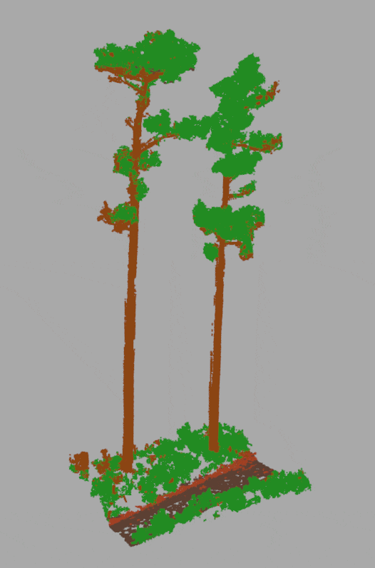
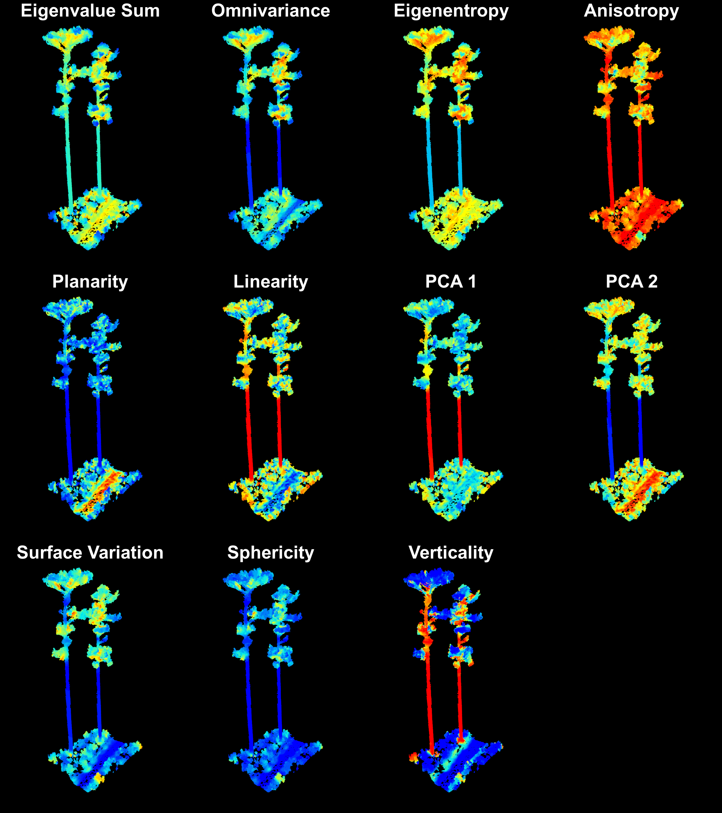

# ForestClassR

## Overview
`ForestClassR` is an R package designed for incorporating forest scene classification of LiDAR data in R environment. 

## Installation
To install `ForestClassR`, use the following commands:

```r
#install.packages("remotes")
library(remotes)
install_github("lucasbielak/ForestClassR")
library(ForestClassR)
```

To set up python enviroment:
```r
setup_env()
```

## Usage example
### Load and Visualize a LAS File
```r
library(lidR)

# Load the LAS file
las <- readLAS(system.file("extdata", "sample.las", package = "ForestClassR"))

# Plot the LAS file
plot(las)
```

### Noise Classification and Removal
```r
# Filter noise using statistical outlier removal (SOR)
las_class <- classify_noise(las, sor(k = 50, m = 3, quantile = FALSE))

# Remove outliers using filter_poi()
las_denoise <- filter_poi(las_class, Classification != LASNOISE)

# Plot the denoised LAS file
plot(las_denoise)
```

### Segmentation
```r
# Segment the denoised LAS file
segmented <- run_fsct(las_denoise)

# Plot the segmented point cloud
custom_colors <- c("#5C4033", "#228B22","#a14023","#8B4513")
plot(segmented, color = "label", pal = custom_colors,bg = "darkgray")
```
<div align="center">  </div>

## Train RF with geometric features

To open an example script from the package, use:

```r
library(remotes)
install_github("lucasbielak/ForestClassR")
library(ForestClassR)

# Random Forest FSCT
open_example("RF_example")
# Random Forest Leaf Wood Classification
open_example("LW_example")
```
<div align="center">  </div>

## References

Krisanski, S.; Taskhiri, M.S.; Gonzalez Aracil, S.; Herries, D.; Muneri, A.; Gurung, M.B.; Montgomery, J.; Turner, P. Forest Structural Complexity Tool—An Open Source, Fully-Automated Tool for Measuring Forest Point Clouds. Remote Sens. 2021, 13, 4677. https://doi.org/10.3390/rs13224677

Hackel, T.; Wegner J. D.; Schindler, K. Contour Detection in Unstructured 3D Point Clouds. Photogrammetry and Remote Sensing, ETH Zürich.

Wang D, Momo Takoudjou S, Casella E. LeWoS: A universal leaf-wood classification method to facilitate the 3D modelling of large tropical trees using terrestrial LiDAR. Methods Ecol Evol. 2020; 11: 376–389. https://doi.org/10.1111/2041-210X.13342

FSCT: https://github.com/SKrisanski/FSCT

jakteristics : https://github.com/jakarto3d/jakteristics

lidUrb:https://github.com/Blecigne/lidUrb

## License
This project is licensed under the GPL-3.0 License - see the LICENSE file for details.

## Author
Developed by Lucas Bielak


